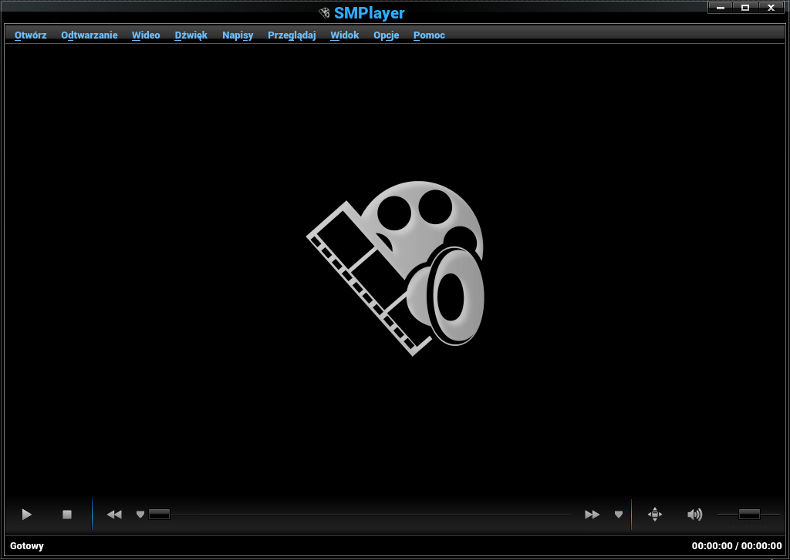

# nouveKDEGray icon theme for SMPlayer

Icons taken from nouveKDEGray
License: GNU General Public License and GNU Lesser General Public License

Installation:
=============

Put this folder in '/usr/share/smplayer/themes/' and select it in SMPlayer > Preferences > Interface > Icon set.

If SMPlayer is installed somewhere else, find the folder "themes" inside its installation directory and do as above.

If SMPlayer's version is at least 20.6.0, you will not need the icons but just the file "nouveKDEGray.rcc".

# Additionally, a ready-made package for Arch Linux was added.

